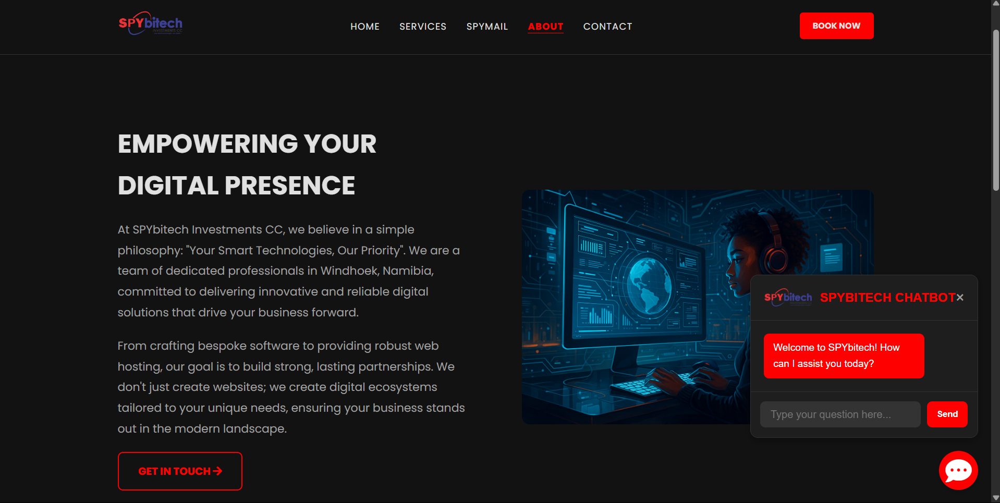

# SPYbitech 🚀

A secure and scalable backend for SPYbitech — user authentication with PostgreSQL and Node.js, using bcrypt for password hashing and environment variables for security.

---

## Features ✨

- **User Authentication:** Secure signup and login with hashed passwords (`bcryptjs`).
- **Database:** PostgreSQL stores user info safely and efficiently.
- **Environment Variables:** Keeps sensitive info like DB credentials private using `.env`.
- **CORS Enabled:** Allows secure communication between frontend and backend.
- **RESTful API:** Easy endpoints for `/signup` and `/login`.

---

## Getting Started ⚙️

### Prerequisites

- [Node.js](https://nodejs.org/) (v18+ recommended)
- [npm](https://www.npmjs.com/get-npm)
- [PostgreSQL](https://www.postgresql.org/download/)

---

### Installation

1. **Clone the repository:**

```bash
git https://github.com/slyskenk/SPYbitech
```

2. **Install dependencies:**

```bash
npm install express @google/generative-ai cors dotenv
npm install express pg bcryptjs cors dotenv
```

3. **Create a `.env` file in the project root with:**

```
GEMINI_API_KEY=YOUR_API_KEY
DB_USER=postgres
DB_HOST=localhost
DB_NAME=spymail_db
DB_PASSWORD=your_postgres_password
DB_PORT=5432
PORT=3000
```

> ⚠️ **Never commit `.env` to version control. Add it to `.gitignore`.**

---

### Database Setup

Create the database and `users` table in PostgreSQL:

```sql
CREATE DATABASE spymail_db;

CREATE TABLE users (
  id SERIAL PRIMARY KEY,
  name VARCHAR(100) NOT NULL,
  email VARCHAR(255) UNIQUE NOT NULL,
  password VARCHAR(255) NOT NULL,
  created_at TIMESTAMP DEFAULT CURRENT_TIMESTAMP
);
```

---

### Running the Server

Start your backend server by opening terminal:

```bash
node index.js
```

You should see:

```
DB password type: string
Backend running on http://localhost:3000
```

---

### Running the AI CHATBOT

Start your Chatbot API in another terminal:

```bash
node server.js
```

You should see:

```

Server listening at http://localhost:3000
```

---

## API Endpoints 📡

| Endpoint  | Method | Description                  | Request Body                            |
|-----------|--------|------------------------------|----------------------------------------|
| `/signup` | POST   | Register a new user          | `{ name, email, password }`            |
| `/login`  | POST   | Authenticate user credentials | `{ email, password }`                   |

---

### Example Signup Request (curl)

```bash
curl -X POST http://localhost:3000/signup \
-H "Content-Type: application/json" \
-d '{"name":"Alice","email":"alice@example.com","password":"mypassword"}'
```

---

### Example Login Request (curl)

```bash
curl -X POST http://localhost:3000/login \
-H "Content-Type: application/json" \
-d '{"email":"alice@example.com","password":"mypassword"}'
```

---

## Frontend Integration 💻

- Use `fetch()` or any AJAX method to send POST requests to `/signup` and `/login`.
- Handle success and error responses accordingly.

---

## Security Notes 🔒

- Passwords are hashed before storage — never store plaintext passwords.
- Use HTTPS in production to secure data in transit.
- Keep your `.env` file secret.
- Consider adding JWT or sessions for authentication after login.

---

## Screenshots & Visuals 🖼️





---

## Troubleshooting 🛠️

- **`DB password type: undefined`**: Check `.env` placement and `dotenv` config.
- **Database connection errors**: Verify credentials and that PostgreSQL server is running.
- **API errors**: Use Postman or browser dev tools to inspect request/response.

---

## Contact ✉️

If you have questions or want to contribute, please reach out at: slyskenk@outlook.com

---

## License 📄

MIT License © 2025 Slysken K

---

*Happy coding! 🚀*
